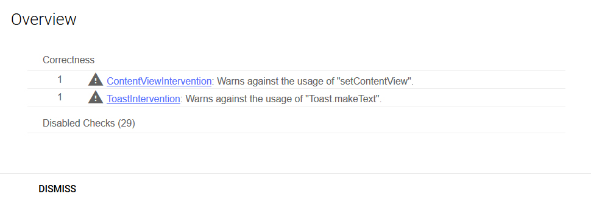

# Intervention

[](https://opensource.org/licenses/Apache-2.0)
[](https://dl.bintray.com/ifanie/izilib/com/izikode/izilib/intervention/0.4/)
[]( https://android-arsenal.com/details/1/7395 )

### Annotation based Android lint check generation
Generate custom Android lint checks and have lint warn you about code you may be dealing with using Kotlin extensions or your own coding 
conventions.

## How is this useful?
We create and annotate the following simple extension functions:
```kotlin
@Intervene(name = "ContentView", warnAgainst = "setContentView")
fun Activity.layout(@LayoutRes layoutRes: Int) {
    this.setContentView(layoutRes)
}

@Intervene(name = "ToastIntervention", warnAgainst = "Toast.makeText")
fun Activity.toast(message: String, length: Int = Toast.LENGTH_SHORT) {
    Toast.makeText(this, message, length).show()
}
```

Having the following sample Activity:
```kotlin
class MainActivity : AppCompatActivity() {
    override fun onCreate(savedInstanceState: Bundle?) {
        super.onCreate(savedInstanceState)

        setContentView(R.layout.activity_main)

        Toast.makeText(this, "Awesome", Toast.LENGTH_SHORT).show()

        toast("Even more Awesome")
    }
}
```

Running lint would generate the following report:


The report is detailed and also includes the annotated code that would fix the issue.

## How to use?
### 1. Preparation
#### a. Lint Module
Custom lint checks in Android need to be created in a Java Module, so go ahead and create one.
``` 
File -> New -> New Module... -> Java Library
```

Intervention generates kotlin code, so you need to apply the Kotlin plugin in the newly created module and instruct the module to
use Kotlin generated files. Also, the module must declate the Registry class for the lint checks it contains; the Registry is generated
by Intervention. Finally it should have a dependency on Android Lint and the main Intervention project. All in all, the Java module's gradle script should look like this:
```groovy
apply plugin: 'java-library'
apply plugin: 'kotlin'

/* Sets the JAVA compatibility */
sourceCompatibility = '1.8'
targetCompatibility = '1.8'

/* Uses kotlin generated code in the project */
sourceSets {
    main {
        java {
            srcDir "${buildDir.absolutePath}/generated/source/kaptKotlin/"
        }
    }
}

/* Declares the lint Registry class */
jar {
    manifest {
        attributes("Lint-Registry-v2": "com.izikode.izilib.interventions.InterventionRegistry")
    }
}

/* All dependencies must be compileOnly as per lint regulations */
dependencies {
    compileOnly "org.jetbrains.kotlin:kotlin-stdlib-jdk8:1.3.11"
    compileOnly "com.android.tools.lint:lint-api:26.2.1"
    compileOnly "com.izikode.izilib:intervention:0.4"
}
```
#### b. Android module
Intevention uses Kotlin code generation, so you must apply the Kapt plugin on your Android module. Also, you must provide the annotation
processor with the path to your Java lint module created above. To do this modify your Android gradle script and add the following:
```groovy
apply plugin: 'kotlin-kapt'

kapt {
    arguments {
        arg('interventionsModuleDir', project(':appinterventions').projectDir.absolutePath)
    }
}
```
##### Replace ```appinterventions``` with the name of your Java lint module.

You must also add the Intervention dependencies in your Android module, as well as the Java lint module:
```groovy
dependencies {
    ...
    implementation "com.izikode.izilib:intervention:0.4"
    kapt "com.izikode.izilib:interventioncompiler:0.4"

    lintChecks project(":appinterventions")
}
```
##### Again replace ```appinterventions``` with the name of your Java lint module.

### 2. Usage
#### a. Annotate
Use the ```Intervene``` annotation to decorate extension or any other functions for which you want to have lint checks. A simple example
is the ToastIntervention from the sample project.
```kotlin
@Intervene(name = "ToastIntervention", warnAgainst = "Toast.makeText")
fun Activity.toast(message: String, length: Int = Toast.LENGTH_SHORT) {
    Toast.makeText(this, message, length).show()
}
```
Another example is the Fragment factory function from the sample project.
```kotlin
class MainFragment : Fragment() {
    companion object {
        @Intervene(name = "MainFragmentInitialization", warnAgainst = "MainFragment()", useInstead = "MainFragment.newInstance()")
        fun newInstance() = MainFragment()
    }
}
```
- ```name``` is the lint check's name and ID. 
- ```warnAgainst``` is the piece of code that when matched will trigger the warning.
- ```useInstead``` is the code that replaces the above. When left empty (default) the compiler will provide the function signature in the report.
- ```priority``` can be either Priority.LOW, Priority.NORMAL (default) or Priority.HIGH.
- ```type``` can be either Type.WARNING (default) or Type.ERROR. *Error stops the build*.

#### b. Build and run lint

#### For a full example, see the sample app.

## Licence
```
Copyright 2018 Fanis Veizis

Licensed under the Apache License, Version 2.0 (the "License");
you may not use this file except in compliance with the License.
You may obtain a copy of the License at

    http://www.apache.org/licenses/LICENSE-2.0

Unless required by applicable law or agreed to in writing, software
distributed under the License is distributed on an "AS IS" BASIS,
WITHOUT WARRANTIES OR CONDITIONS OF ANY KIND, either express or implied.
See the License for the specific language governing permissions and
limitations under the License.
```
